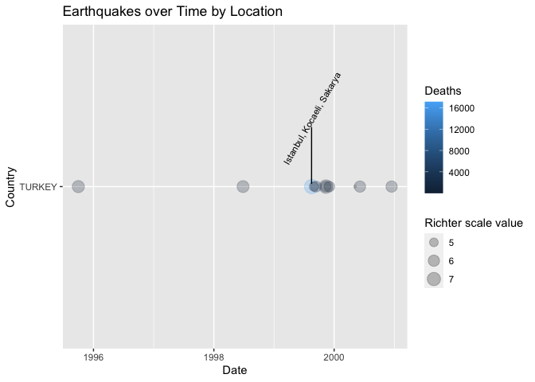

<!-- README.md is generated from README.Rmd. Please edit that file -->


# mycapstone

<!-- badges: start -->
[](https://travis-ci.com/cemreyilmaz/mycapstone)
<!-- badges: end -->

The goal of mycapstone is to analyze the earthquake data that were collected and 
archived by NOAA and that can be found at 
<https://www.ngdc.noaa.gov/hazard/strong.shtml>.

## Installation

You can install the released version of mycapstone from [CRAN](https://CRAN.R-project.org) with:

``` r
install.packages("mycapstone")
```

## Example_clean

This is a basic example which shows you how to clean your data:


```r
library(mycapstone)
## basic example code
data <- utils::read.delim("earthquakes.tsv")
data <- eq_clean_data(data)
data <- eq_location_clean(data)
```

## Example_visualize

This is a basic example which shows you how to visualize your data:


```r
library(mycapstone)
## basic example code
data <- utils::read.delim("earthquakes.tsv")
data <- eq_clean_data(data)
data <- eq_location_clean(data)
data <- dplyr::filter(data, Country == "TURKEY")
geom_timeline_label(data,7.5)
```



## Example_map

This is a basic example which shows you how to create an interactive map from your data:


```r
library(mycapstone)
## basic example code
data <- utils::read.delim("earthquakes.tsv")
data <- eq_clean_data(data)
data <- eq_location_clean(data)
data <- dplyr::filter(data, Country == "TURKEY")
data <- dplyr::mutate(data, popup_text = eq_create_label(data))
eq_map(data, "popup_text")
```

```{=html}
<div id="htmlwidget-01e2e5051e07db7ee721" style="width:100%;height:480px;" class="leaflet html-widget"></div>
<script type="application/json" data-for="htmlwidget-01e2e5051e07db7ee721">{"x":{"options":{"crs":{"crsClass":"L.CRS.EPSG3857","code":null,"proj4def":null,"projectedBounds":null,"options":{}}},"calls":[{"method":"addTiles","args":["//{s}.tile.openstreetmap.org/{z}/{x}/{y}.png",null,null,{"minZoom":0,"maxZoom":18,"tileSize":256,"subdomains":"abc","errorTileUrl":"","tms":false,"noWrap":false,"zoomOffset":0,"zoomReverse":false,"opacity":1,"zIndex":1,"detectRetina":false,"attribution":"&copy; <a href=\"http://openstreetmap.org\">OpenStreetMap<\/a> contributors, <a href=\"http://creativecommons.org/licenses/by-sa/2.0/\">CC-BY-SA<\/a>"}]},{"method":"addCircleMarkers","args":[[38.063,36.878,40.76,40.711,40.709,40.744,40.758,40.358,38.164,40.693,38.457],[30.134,35.307,29.97,29.949,30.045,30.266,31.161,42.346,38.777,32.992,31.351],[6.4,6.3,7.6,5.2,5.8,5.7,7.2,5.7,4.1,6,6],null,null,{"interactive":true,"className":"","stroke":true,"color":"#03F","weight":5,"opacity":0.5,"fill":true,"fillColor":"#03F","fillOpacity":0.2},null,null,["<b>Location: <\/b>  Dinar, Evciler<br/><b>Magnitude: <\/b>6.4<br/><b>Total deaths: <\/b>95","<b>Location: <\/b> Adana, Ceyhan<br/><b>Magnitude: <\/b>6.3<br/><b>Total deaths: <\/b>145","<b>Location: <\/b> Istanbul, Kocaeli, Sakarya<br/><b>Magnitude: <\/b>7.6<br/><b>Total deaths: <\/b>17118","<b>Location: <\/b> Izmit<br/><b>Magnitude: <\/b>5.2<br/><b>Total deaths: <\/b>1","<b>Location: <\/b> Adapazari-Goluck-Kocaeli<br/><b>Magnitude: <\/b>5.8<br/><b>Total deaths: <\/b>7","<b>Location: <\/b> Adapazari, Koceali, Golcuk<br/><b>Magnitude: <\/b>5.7<br/><b>Total deaths: <\/b>2","<b>Location: <\/b> Bolu-Duzce-Kaynasli, Adapazari, Zonguldak<br/><b>Magnitude: <\/b>7.2<br/><b>Total deaths: <\/b>894","<b>Location: <\/b> Goresken, Erzurum Province<br/><b>Magnitude: <\/b>5.7<br/><b>Total deaths: <\/b>1","<b>Location: <\/b> Doganyol, Puturge<br/><b>Magnitude: <\/b>4.1<br/><b>Total deaths: <\/b>NA","<b>Location: <\/b> Cerkes, Cubuk, Orta<br/><b>Magnitude: <\/b>6<br/><b>Total deaths: <\/b>2","<b>Location: <\/b> Afyon-Bolvadin<br/><b>Magnitude: <\/b>6<br/><b>Total deaths: <\/b>6"],null,null,{"interactive":false,"permanent":false,"direction":"auto","opacity":1,"offset":[0,0],"textsize":"10px","textOnly":false,"className":"","sticky":true},null]}],"limits":{"lat":[36.878,40.76],"lng":[29.949,42.346]}},"evals":[],"jsHooks":[]}</script>
```
